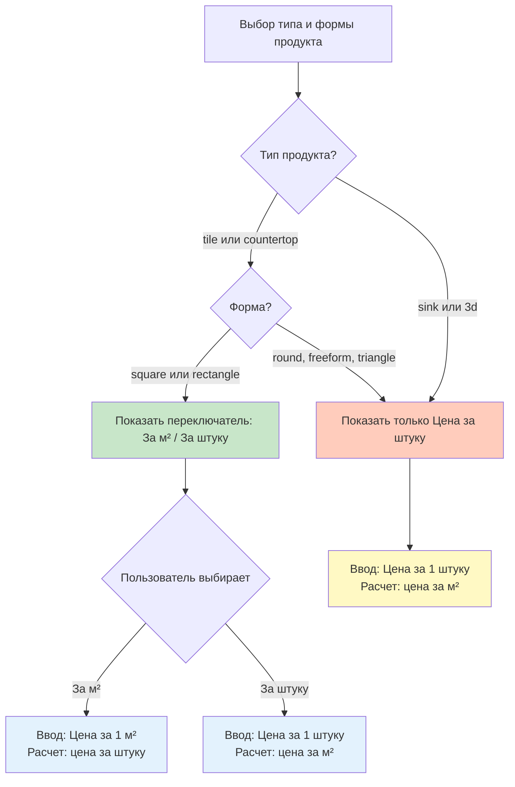
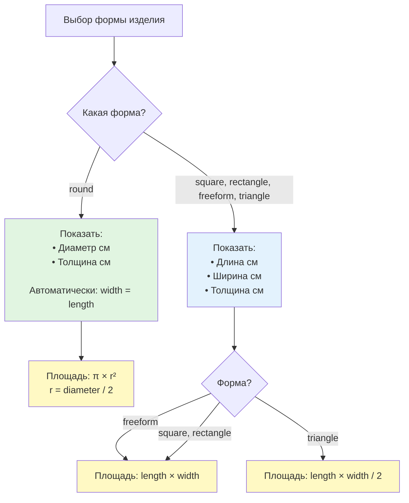

# План: Разделение форм + названия печей + логика ввода цены камня

## Обзор

Три основные задачи:
1. Разделить "Круглая/неправильная" на две формы: "Круглая" (диаметр + толщина) и "Криволинейная" (длина × ширина)
2. Обновить названия печей: "Большая (старая)" и "Малая (новая)"
3. Условное отображение полей ввода цены камня в зависимости от типа продукта и формы

## Часть 1: Разделение форм

### 1.1 Обновить тип TileShape

**Файл:** [`src/types/index.ts`](src/types/index.ts), строка 55

Добавить новый тип формы `freeform`:

```typescript
export type TileShape = 'square' | 'rectangle' | 'round' | 'freeform' | 'triangle';
```

### 1.2 Добавить UI для криволинейной формы

**Файл:** [`src/App.tsx`](src/App.tsx) или соответствующий компонент выбора формы

Добавить новую радио-кнопку после "Круглая":
- Текст: "Криволинейная форма"
- Value: `freeform`

### 1.3 Условное отображение полей размеров

**Файл:** [`src/App.tsx`](src/App.tsx) или [`src/components/ProductInput.tsx`](src/components/ProductInput.tsx)

**Логика:**

Для формы `round`:
- Показать поле "Диаметр (см)" (использовать `dimensions.length`)
- Показать поле "Толщина (см)"
- Скрыть поле "Ширина (см)"
- При изменении диаметра автоматически устанавливать `width = length`

Для всех остальных форм (`square`, `rectangle`, `freeform`, `triangle`):
- Показать все три поля: "Длина (см)", "Ширина (см)", "Толщина (см)"

### 1.4 Обновить calculateProductArea

**Файл:** [`src/utils/kilnCalculations.ts`](src/utils/kilnCalculations.ts), функция `calculateProductArea` (строки 48-71)

Текущая логика для `round`:
```typescript
if (shape === 'round') {
  const diameter = Math.max(product.length, product.width);
  const radius = diameter / 2 / 100;
  return Math.PI * radius * radius;
}
```

Новая логика:

```typescript
if (shape === 'round') {
  // Для круга diameter уже равен length и width
  const diameter = product.length;
  const radius = diameter / 2 / 100; // в метры
  return Math.PI * radius * radius;
} else if (shape === 'freeform') {
  // Для криволинейной формы считаем как прямоугольник
  const lengthM = product.length / 100;
  const widthM = product.width / 100;
  return lengthM * widthM;
}
```

### 1.5 Обновить getEffectiveDimensions

**Файл:** [`src/utils/kilnCalculations.ts`](src/utils/kilnCalculations.ts), функция `getEffectiveDimensions` (строки 79-102)

Добавить обработку для `freeform`:

```typescript
if (shape === 'round') {
  // Круг занимает квадратное пространство
  const diameter = product.length;
  effectiveLength = diameter;
  effectiveWidth = diameter;
} else if (shape === 'freeform') {
  // Криволинейная форма занимает прямоугольное пространство
  effectiveLength = product.length;
  effectiveWidth = product.width;
} else if (shape === 'triangle') {
  // ... существующая логика для треугольника
}
```

## Часть 2: Обновление названий печей

### 2.1 Обновить константы

**Файл:** [`src/utils/constants.ts`](src/utils/constants.ts), строки 4-19

Изменить названия печей:

```typescript
export const KILNS: Record<KilnType, KilnConfig> = {
  big: {
    name: 'Большая (старая)',
    // ... остальные параметры
  },
  small: {
    name: 'Малая (новая)',
    // ... остальные параметры
  },
};
```

## Часть 3: Условная логика ввода цены камня

### 3.1 Определить функцию shouldShowBothPriceInputs

**Файл:** Создать в [`src/App.tsx`](src/App.tsx) или в отдельном utils файле

```typescript
function shouldShowBothPriceInputs(
  productType: ProductType,
  tileShape: TileShape
): boolean {
  // Показываем оба поля (за м² И за штуку) только для:
  // - tile или countertop
  // - И только для square или rectangle форм
  const allowedTypes: ProductType[] = ['tile', 'countertop'];
  const allowedShapes: TileShape[] = ['square', 'rectangle'];
  
  return allowedTypes.includes(productType) && allowedShapes.includes(tileShape);
}
```

### 3.2 Обновить StoneCostInput компонент

**Файл:** [`src/components/StoneCostInput.tsx`](src/components/StoneCostInput.tsx)

**Изменения:**

1. Добавить новые props:
```typescript
interface StoneCostInputProps {
  productArea: number;
  onStoneCostChange: (costPerSqM: number) => void;
  initialCostPerSqM?: number;
  onShowDB: () => void;
  onAutoFind: () => void;
  showDB: boolean;
  // НОВЫЕ:
  showBothInputs: boolean; // если false, показываем только "за штуку"
}
```

2. Изменить логику отображения:

```typescript
{showBothInputs ? (
  <>
    {/* Переключатель режима */}
    <div className="price-mode-toggle">
      <label className="price-mode-label">
        <input type="radio" ... />
        <span>За 1 м² (mil Rp)</span>
      </label>
      <label className="price-mode-label">
        <input type="radio" ... />
        <span>За 1 штуку (mil Rp)</span>
      </label>
    </div>

    {/* Инпут в зависимости от режима */}
    {inputMode === 'perSqM' ? (
      <div className="input-group">
        <label>Цена за 1 м² (mil Rp)</label>
        <input ... />
        <div className="calculated-info">
          За 1 шт: <strong>{pricePerPcs.toFixed(3)} mil Rp</strong>
        </div>
      </div>
    ) : (
      <div className="input-group">
        <label>Цена за 1 штуку (mil Rp)</label>
        <input ... />
        <div className="calculated-info">
          За 1 м²: <strong>{pricePerSqM.toFixed(3)} mil Rp</strong>
        </div>
      </div>
    )}
  </>
) : (
  // Режим "только за штуку"
  <div className="input-group">
    <label>Цена за 1 штуку (mil Rp)</label>
    <input
      type="number"
      step="0.001"
      min="0"
      value={pricePerPcs}
      onChange={(e) => handlePerPcsChange(parseFloat(e.target.value) || 0)}
      placeholder="0.011"
    />
    <div className="calculated-info">
      За 1 м²: <strong>{pricePerSqM.toFixed(3)} mil Rp</strong>
    </div>
  </div>
)}
```

### 3.3 Передать showBothInputs в StoneCostInput

**Файл:** [`src/App.tsx`](src/App.tsx), где рендерится `<StoneCostInput>`

```typescript
const showBothPriceInputs = shouldShowBothPriceInputs(productType, tileShape);

<StoneCostInput
  productArea={productArea}
  onStoneCostChange={handleStoneCostChange}
  initialCostPerSqM={stoneCost}
  onShowDB={() => setShowStoneDB(true)}
  onAutoFind={() => handleAutoFindStone(dimensions)}
  showDB={showStoneDB}
  showBothInputs={showBothPriceInputs}
/>
```

## Часть 4: Убрать автоматический пересчет стоимости

### 4.1 Удалить useEffect

**Файл:** [`src/App.tsx`](src/App.tsx), строки 323-335

Удалить весь блок:

```typescript
// УДАЛИТЬ ЭТО:
useEffect(() => {
  if (costResult) {
    const currentProduct = costKilnType === 'average'
      ? (kilnResults.big || kilnResults.small)?.product
      : kilnResults[costKilnType as KilnType]?.product;
    
    if (currentProduct) {
      calculateCostResult(currentProduct);
    }
  }
}, [costKilnType, mode, customParams, stoneCost, orderQuantity]);
```

### 4.2 Упростить onChange в CostParametersComponent

**Файл:** [`src/App.tsx`](src/App.tsx), где рендерится `<CostParametersComponent>`

Найти `onChange` handler и упростить:

Было:
```typescript
onChange={(updates) => {
  setCustomParams({ ...customParams, ...updates });
  // Пересчитываем при изменении параметров
  const currentProduct = ...
  if (currentProduct && currentResult) {
    calculateCostResult(currentProduct, currentResult);
  }
}}
```

Станет:
```typescript
onChange={(updates) => {
  setCustomParams({ ...customParams, ...updates });
}}
```

### 4.3 Проверить импорт useEffect

**Файл:** [`src/App.tsx`](src/App.tsx), строка 1

Если `useEffect` больше нигде не используется в `App.tsx`, удалить его из импорта:

Было:
```typescript
import { useState, useEffect } from 'react';
```

Станет:
```typescript
import { useState } from 'react';
```

**Важно:** Проверить, используется ли `useEffect` в других местах `App.tsx` перед удалением!

## Диаграмма: Логика отображения полей цены



## Диаграмма: Логика отображения полей размеров



## Часть 5: Упрощение результатов расчета стоимости

### 5.1 Изменить значение по умолчанию для количества штук

**Файл:** [`src/App.tsx`](src/App.tsx), строка 44

Изменить:
```typescript
const [orderQuantity, setOrderQuantity] = useState<number>(0); // было 1
```

Добавить валидацию: не позволять расчет стоимости, если `orderQuantity === 0`.

### 5.2 Упростить CostResults компонент

**Файл:** [`src/components/CostResults.tsx`](src/components/CostResults.tsx)

**Изменения:**

1. **Убрать отображение маржи и процента маржи:**
   - Удалить строки с `margin` и `marginPercent`

2. **Убрать сравнение рынков:**
   - Оставить только один блок результатов (без разделения на Indonesia / Abroad)
   - Показывать только "Цена за 1 м²" и "Цена за 1 изделие"
   - Использовать данные из `result.indonesia` (или можно переименовать логику)

Пример упрощенной структуры:
```typescript
<div className="cost-results">
  <h3>Результаты расчета</h3>
  
  <div className="price-result">
    <div className="price-label">Цена за 1 м²</div>
    <div className="price-value">
      {result.indonesia.pricePerSqM.toLocaleString('id-ID')} IDR
    </div>
  </div>
  
  <div className="price-result">
    <div className="price-label">Цена за 1 изделие</div>
    <div className="price-value">
      {result.indonesia.pricePerPcs.toLocaleString('id-ID')} IDR
    </div>
  </div>
  
  {/* Убрать блоки с margin, marginPercent, и Abroad */}
</div>
```

## Порядок выполнения

1. Обновить тип `TileShape` в `types/index.ts`
2. Добавить UI для выбора "Криволинейная форма"
3. Реализовать условное отображение полей размеров (диаметр для круглых)
4. Обновить `calculateProductArea` для обработки `round` и `freeform`
5. Обновить `getEffectiveDimensions` для обработки `freeform`
6. Обновить названия печей в `constants.ts`
7. Создать функцию `shouldShowBothPriceInputs`
8. Обновить `StoneCostInput` компонент с условной логикой
9. Передать `showBothInputs` prop в `StoneCostInput`
10. Удалить `useEffect` для автопересчета стоимости
11. Упростить `onChange` в `CostParametersComponent`
12. Очистить импорт `useEffect` если не используется
13. Изменить `orderQuantity` по умолчанию на 0
14. Добавить валидацию для `orderQuantity` перед расчетом
15. Упростить `CostResults` - убрать маржу и сравнение рынков

## Тестирование

После внесения изменений проверить:

1. **Круглая форма:**
   - Вводится только диаметр (30 см)
   - Площадь: π × (0.15)² = 0.0707 м²
   - Занимаемое место: 30×30 см

2. **Криволинейная форма:**
   - Вводятся длина (30 см) и ширина (40 см)
   - Площадь: 0.30 × 0.40 = 0.12 м²
   - Занимаемое место: 30×40 см

3. **Названия печей:**
   - "Большая (старая)" вместо "Большая печь"
   - "Малая (новая)" вместо "Малая печь"

4. **Ввод цены камня:**
   - tile + square: показывать оба поля
   - tile + round: только "за штуку"
   - countertop + rectangle: показывать оба поля
   - sink + square: только "за штуку"
   - 3d + любая форма: только "за штуку"

5. **Пересчет стоимости:**
   - Изменение параметров НЕ вызывает автопересчет
   - Кнопка "Рассчитать стоимость" корректно обновляет результаты

6. **Количество штук в заказе:**
   - По умолчанию = 0
   - Нельзя рассчитать стоимость, пока не введено значение > 0
   - Валидация работает корректно

7. **Результаты расчета стоимости:**
   - Не показывается маржа и процент маржи
   - Нет сравнения рынков Indonesia / Abroad
   - Показываются только: "Цена за 1 м²" и "Цена за 1 изделие"
