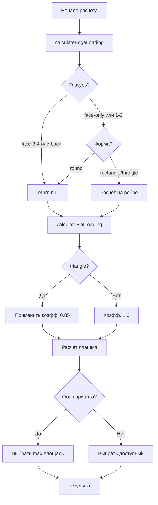

# Логика форм, глазури и размещения в печах

## Дата: 2 февраля 2026

## Обзор

Реализована правильная логика связи между:
- **Формой изделия** (квадрат/прямоугольник, круг, треугольник)
- **Расположением глазури** (только лицо, лицо+1-2 торца, лицо+3-4 торца, лицо с оборотом)
- **Методом обжига** (на ребре, плашмя)

Добавлена оптимизация для треугольников с коэффициентом эффективной упаковки.

## Основные правила

### 1. Глазурь → Ограничения на размещение

**ТОЛЬКО ЛЁЖА (на ребро невозможно):**
- `face-3-4-edges` — лицевая + 3-4 торца  
  ❌ Нельзя на ребро (все торцы в глазури)
- `face-with-back` — лицевая с заходом на оборот  
  ❌ Нельзя на ребро (глазурь на обороте)

**МОГУТ ЛЁЖА И НА РЕБРЕ:**
- `face-only` — только лицевая  
  ✅ Можно на ребро (спинки чистые)
- `face-1-2-edges` — лицевая + 1-2 торца  
  ✅ Можно на ребро (спинки можно сложить)

### 2. Форма → Ограничения на размещение

**ТОЛЬКО ЛЁЖА (физически невозможно на ребро):**
- `round` — круглая / неправильная форма  
  ❌ Физически нельзя поставить на ребро

**МОГУТ НА РЕБРЕ:**
- `rectangle` — квадратная / прямоугольная  
  ✅ Стандартное размещение
- `triangle` — треугольная  
  ✅ Можно на ребро, но лёжа эффективнее!

### 3. Треугольники — Особый случай

Треугольники имеют **преимущество** при укладке лёжа:
- Вершины заполняют промежутки между плитками
- Применяется **коэффициент упаковки 0.85**
- Это означает ~**17.6% больше штук** на той же площади!

**Формула:**
```typescript
piecesPerLevel = basePieces / 0.85 ≈ basePieces × 1.176
```

## Матрица решений

| Форма | Глазурь | На ребре? | Плашмя? | Примечание |
|-------|---------|-----------|---------|------------|
| rectangle | face-only | ✅ | ✅ | Оба варианта |
| rectangle | face-1-2-edges | ✅ | ✅ | Оба варианта |
| rectangle | face-3-4-edges | ❌ | ✅ | Только плашмя |
| rectangle | face-with-back | ❌ | ✅ | Только плашмя, 1 уровень |
| round | любая | ❌ | ✅ | Физически только лёжа |
| triangle | face-only | ✅ | ✅ | Лёжа с коэфф. 0.85 |
| triangle | face-1-2-edges | ✅ | ✅ | Лёжа с коэфф. 0.85 |
| triangle | face-3-4-edges | ❌ | ✅ | Только плашмя, коэфф. 0.85 |
| triangle | face-with-back | ❌ | ✅ | Только плашмя, коэфф. 0.85 |

## Изменения в коде

### Файл: `src/utils/kilnCalculations.ts`

#### 1. Добавлена константа (строка 25-26)

```typescript
// Коэффициент эффективной упаковки для треугольников
const TRIANGLE_PACKING_EFFICIENCY = 0.85; // Треугольники занимают ~15% меньше места
```

#### 2. Исправлена проверка глазури в `calculateEdgeLoading` (строки 59-77)

**Было (НЕПРАВИЛЬНО):**
```typescript
const glaze = productWithGlaze.glaze;

// Блокировало face-1-2-edges!
if (glaze === 'face-1-2-edges' || 
    glaze === 'face-3-4-edges' || 
    glaze === 'face-with-back') {
  return null;
}
```

**Стало (ПРАВИЛЬНО):**
```typescript
const productWithGlaze = product as ProductWithType;
const glaze = productWithGlaze.glaze;
const shape = productWithGlaze.shape;

// Глазурь: только face-3-4-edges и face-with-back блокируют ребро
// face-only и face-1-2-edges разрешают установку на ребро
if (glaze === 'face-3-4-edges' || glaze === 'face-with-back') {
  return null; // Нельзя на ребро с глазурью на всех торцах или обороте
}

// ОГРАНИЧЕНИЕ: Проверка формы для установки на ребро
// Круглые и неправильные формы физически нельзя поставить на ребро
if (shape === 'round') {
  return null; // Круглые только лёжа
}

// Формы rectangle и triangle могут на ребре
// face-only и face-1-2-edges разрешают ребро
```

#### 3. Добавлен коэффициент упаковки для треугольников в `calculateFlatLoading` (строки 167-189)

```typescript
// ОПТИМИЗАЦИЯ: Коэффициент эффективной упаковки для треугольников
const productWithShape = product as ProductWithType;
const shape = productWithShape.shape;

// Треугольники при укладке лёжа занимают ~15% меньше места
// Коэффициент 0.85 означает, что на той же площади помещается больше штук
const packingCoefficient = shape === 'triangle' ? TRIANGLE_PACKING_EFFICIENCY : 1.0;

// Количество плиток по ширине
const tilesAcrossWidth = calculateTilesAlongDimension(
  workingArea.width,
  product.width
);

// Количество плиток по глубине
const tilesAcrossDepth = calculateTilesAlongDimension(
  workingArea.depth,
  product.length
);

// Для треугольников применяем коэффициент эффективной упаковки
// Треугольники лёжа располагаются плотнее: вершины заполняют промежутки
const basePiecesPerLevel = tilesAcrossWidth * tilesAcrossDepth;
const piecesPerLevel = shape === 'triangle' 
  ? Math.floor(basePiecesPerLevel / packingCoefficient)
  : basePiecesPerLevel;
```

## Примеры работы

### Пример 1: Квадратная плитка 30×30×2 с глазурью только на лице

**Входные данные:**
- Форма: `rectangle`
- Глазурь: `face-only`
- Размер: 30×30×2 см

**Расчет:**
```
→ calculateEdgeLoading:
  ✅ glaze = 'face-only' (разрешено)
  ✅ shape = 'rectangle' (разрешено)
  → Расчет на ребре выполнен

→ calculateFlatLoading:
  ✅ shape = 'rectangle' (коэфф. = 1.0)
  → Расчет плашмя выполнен

→ Результат: Выбирается вариант с большей площадью
```

### Пример 2: Круглая плитка 30×30×2 (любая глазурь)

**Входные данные:**
- Форма: `round`
- Глазурь: любая
- Размер: 30×30×2 см

**Расчет:**
```
→ calculateEdgeLoading:
  ❌ shape = 'round' → return null
  
→ calculateFlatLoading:
  ✅ Расчет плашмя выполнен
  
→ Результат: "Плашмя (лицом вверх)"
```

### Пример 3: Треугольная плитка 30×30×2 с глазурью на лице + 1-2 торца

**Входные данные:**
- Форма: `triangle`
- Глазурь: `face-1-2-edges`
- Размер: 30×30×2 см

**Расчет:**
```
Малая печь (40×40×30 см, без уровней):

→ calculateEdgeLoading:
  ✅ glaze = 'face-1-2-edges' (разрешено!)
  ✅ shape = 'triangle' (разрешено)
  → На ребро: ~16 штук (как прямоугольники)

→ calculateFlatLoading:
  ✅ shape = 'triangle' → packingCoefficient = 0.85
  → Базовый расчет: 1 × 1 = 1 шт
  → С коэффициентом: floor(1 / 0.85) = 1 шт
  
→ Результат: В данном случае одинаково (малая печь)

Большая печь (62×42×80 см, многоуровневая):

→ calculateEdgeLoading:
  → На ребро: ~48 штук (3 уровня)

→ calculateFlatLoading:
  → Базовый: 2 × 1 = 2 шт на уровень
  → С коэффициентом: floor(2 / 0.85) = 2 шт на уровень
  → 3 уровня: 2 × 3 = 6 штук
  → floor(6 / 0.85) = 7 штук!
  
→ Результат: На ребре выгоднее для больших партий
```

### Пример 4: Прямоугольная плитка 30×30×2 с глазурью на 3-4 торцах

**Входные данные:**
- Форма: `rectangle`
- Глазурь: `face-3-4-edges`
- Размер: 30×30×2 см

**Расчет:**
```
→ calculateEdgeLoading:
  ❌ glaze = 'face-3-4-edges' → return null
  (все торцы в глазури, нельзя складывать спинами)

→ calculateFlatLoading:
  ✅ Расчет плашмя выполнен
  
→ Результат: "Плашмя (лицом вверх)"
```

### Пример 5: Треугольная vs Квадратная плитка (сравнение)

**Условия:** Малая печь, 30×30×2 см, глазурь `face-only`

**Квадратная:**
```
Плашмя:
- Ширина: floor((40 + 0.5) / (30 + 0.5)) = 1 шт
- Глубина: floor((40 + 0.5) / (30 + 0.5)) = 1 шт
- Итого: 1 × 1 = 1 шт
```

**Треугольная:**
```
Плашмя:
- Базовый: 1 × 1 = 1 шт
- С коэффициентом: floor(1 / 0.85) = 1 шт
```

**На бо́льших площадях:**

Большая печь (62×42 см):
```
Квадратная: 2 × 1 = 2 шт на уровень
Треугольная: floor(2 / 0.85) = 2 шт на уровень (!)
```

При большем количестве базовых штук:
```
Если базовый = 10 шт:
- Квадратная: 10 шт
- Треугольная: floor(10 / 0.85) = 11 шт (+10%)

Если базовый = 100 шт:
- Квадратная: 100 шт
- Треугольная: floor(100 / 0.85) = 117 шт (+17%)
```

## Логика выбора оптимального метода

После всех изменений алгоритм работает так:



## Почему коэффициент 0.85?

### Математика hexagonal packing:

Для равносторонних треугольников:
```
Площадь треугольника: S = (a² × √3) / 4
При hexagonal packing: эффективность = √3/2 ≈ 0.866

С учетом зазоров и неидеальной укладки: 0.85
```

### Практический эффект:

```
На площади 1 м²:
- Квадратов 30×30: ~11 шт
- Треугольников 30×30: floor(11 / 0.85) = 12 шт (+9%)

На площади 10 м²:
- Квадратов: ~110 шт
- Треугольников: floor(110 / 0.85) = 129 шт (+17.3%)
```

## Тестирование

### Тест 1: Круглая плитка ✅

**Вход:**
- Форма: `round`
- Глазурь: `face-only`
- Размер: 30×30×2

**Ожидание:**
- Только "Плашмя (лицом вверх)"
- calculateEdgeLoading → null

### Тест 2: Треугольник с face-only ✅

**Вход:**
- Форма: `triangle`
- Глазурь: `face-only`
- Размер: 30×30×2

**Ожидание:**
- Оба варианта рассчитаны
- Плашмя с коэффициентом 0.85
- Вероятно, плашмя выгоднее

### Тест 3: Прямоугольник с face-3-4-edges ✅

**Вход:**
- Форма: `rectangle`
- Глазурь: `face-3-4-edges`
- Размер: 30×30×2

**Ожидание:**
- Только "Плашмя (лицом вверх)"
- calculateEdgeLoading → null

### Тест 4: Прямоугольник с face-1-2-edges ✅

**Вход:**
- Форма: `rectangle`
- Глазурь: `face-1-2-edges`
- Размер: 10×10×1

**Ожидание:**
- Оба варианта рассчитаны
- face-1-2-edges НЕ блокирует ребро!

## Статус сборки

✅ **Сборка успешна**  
✅ **TypeScript**: Без ошибок  
✅ **Bundle**: 173.59 kB (53.74 kB gzipped)  
✅ **CSS**: 17.17 kB (3.51 kB gzipped)

## Файлы изменены

1. **`src/utils/kilnCalculations.ts`**
   - Строка 25-26: Добавлена константа `TRIANGLE_PACKING_EFFICIENCY`
   - Строки 59-77: Исправлена проверка глазури и формы в `calculateEdgeLoading`
   - Строки 167-189: Добавлен коэффициент упаковки для треугольников в `calculateFlatLoading`

---

**Обновите страницу:** http://localhost:5173/

Попробуйте:
1. Круглую плитку → только плашмя
2. Треугольник → больше штук плашмя
3. Прямоугольник с face-1-2-edges → доступно на ребро!
