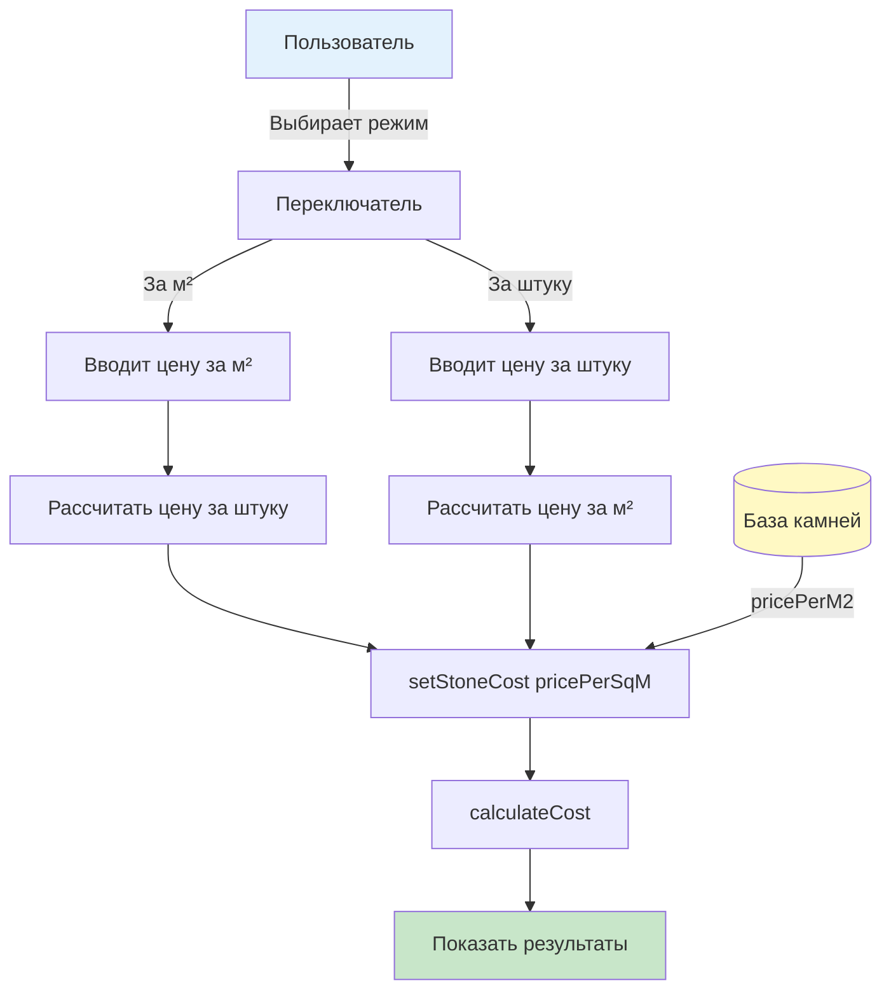

# Исправление: Ввод цены камня за м² или за штуку + удаление CAPEX/OPEX

## Дата: 3 февраля 2026

## Проблема

1. **Неправильный формат ввода цены**: Система предлагала вводить цену камня "за кг" или "за м²", но пользователю нужно "за м²" или "за штуку"
2. **Лишняя информация в результатах**: В разделе "Параметры расчета" показывались CAPEX, OPEX, электричество и зарплата, которые пользователь не должен видеть

## Решение

### 1. Переработан компонент StoneCostInput.tsx

**Файл:** `src/components/StoneCostInput.tsx`

**Изменения:**

#### Интерфейс компонента
```typescript
interface StoneCostInputProps {
  productArea: number; // м² одного изделия (length × width / 10000)
  onStoneCostChange: (costPerSqM: number) => void;
  initialCostPerSqM?: number;
  onShowDB: () => void;
  onAutoFind: () => void;
  showDB: boolean;
}
```

#### Режимы ввода
- **Было:** `perKg` | `perSqM` (неправильно)
- **Стало:** `perSqM` | `perPcs` (правильно)

#### Логика пересчета
```typescript
// От м² к штуке
const pricePerPcs = pricePerSqM * productArea;

// От штуки к м²
const pricePerSqM = pricePerPcs / productArea;
```

#### UI изменения
- "За 1 кг (mil Rp)" → "За 1 м² (mil Rp)"
- "За 1 м² (mil Rp)" → "За 1 штуку (mil Rp)"
- Показывается пересчет: "За 1 шт: X mil Rp" или "За 1 м²: X mil Rp"
- Добавлена информация о площади изделия внизу

### 2. Обновлен App.tsx

**Файл:** `src/App.tsx`

**Изменения:**

#### Передача productArea в компонент
```tsx
<StoneCostInput
  productArea={
    (kilnResults[costKilnType as KilnType]!.product.length *
     kilnResults[costKilnType as KilnType]!.product.width) / 10000
  }
  onStoneCostChange={setStoneCost}
  initialCostPerSqM={stoneCost}
  // ... other props
/>
```

#### Обновлены функции выбора камня
```typescript
const handleStoneSelect = (stone: StoneEntry) => {
  setStoneCost(stone.pricePerM2); // было: stone.pricePerUnit
  setShowStoneDB(false);
  alert(`Выбран камень: ${stone.name}\nЦена: ${stone.pricePerM2} mil Rp за м²`);
};

const handleAutoFindStone = (product: ProductDimensions) => {
  const stone = findStoneByCriteria(productType, product);
  if (stone) {
    setStoneCost(stone.pricePerM2); // было: stone.pricePerUnit
    alert(`Автоматически выбран: ${stone.name}\nЦена: ${stone.pricePerM2} mil Rp за м²`);
  }
};
```

### 3. Удалены разделы из CostParameters.tsx

**Файл:** `src/components/CostParameters.tsx`

**Удалены следующие секции:**

1. **Постоянные затраты** (строки 20-31):
   - CAPEX: 405 mil Rp
   - OPEX (в месяц): 235 mil Rp

2. **Стоимость обжига** (строки 33-44):
   - Электричество: 0.36 mil Rp
   - Зарплата + налоги: 0.93 mil Rp

**Результат:** Компонент теперь начинается сразу с раздела "Стоимость камня (на м²)"

### 4. Обновлен costCalculations.ts

**Файл:** `src/utils/costCalculations.ts`

**Изменение:** Уточнен комментарий к параметру `stoneCost`
```typescript
stoneCost: number, // mil Rp за м² - из базы или ввод пользователя
```

### 5. База данных камней

**Формат:** База данных уже правильно хранила оба формата цены:
```typescript
export interface StoneEntry {
  id: string;
  name: string;
  pricePerUnit: number; // mil Rp (за единицу, устаревшее)
  pricePerM2: number;   // mil Rp (за м², используется теперь)
  dateAdded: Date;
  productType?: ProductType;
  sizeRange?: string;
}
```

**Изменения:** Теперь система использует `stone.pricePerM2` вместо `stone.pricePerUnit`

## Поток данных



## Визуальное представление

### Режим "За 1 м²"
```
┌────────────────────────────────────┐
│ Цена камня                         │
├────────────────────────────────────┤
│ ● За 1 м² (mil Rp)                 │
│ ○ За 1 штуку (mil Rp)              │
├────────────────────────────────────┤
│ Цена за 1 м² (mil Rp)              │
│ [1.095]                            │
│                                    │
│ За 1 шт: 0.011 mil Rp              │
├────────────────────────────────────┤
│ [База данных]  [Автоподбор]        │
├────────────────────────────────────┤
│ Площадь изделия: 0.0100 м²        │
└────────────────────────────────────┘
```

### Режим "За 1 штуку"
```
┌────────────────────────────────────┐
│ Цена камня                         │
├────────────────────────────────────┤
│ ○ За 1 м² (mil Rp)                 │
│ ● За 1 штуку (mil Rp)              │
├────────────────────────────────────┤
│ Цена за 1 штуку (mil Rp)           │
│ [0.011]                            │
│                                    │
│ За 1 м²: 1.095 mil Rp              │
├────────────────────────────────────┤
│ [База данных]  [Автоподбор]        │
├────────────────────────────────────┤
│ Площадь изделия: 0.0100 м²        │
└────────────────────────────────────┘
```

## Примеры пересчета

### Пример 1: Плитка 10x10 см
- **Площадь:** 0.01 м²
- **Цена за м²:** 1.095 mil Rp
- **Цена за штуку:** 1.095 × 0.01 = 0.011 mil Rp

### Пример 2: Плитка 20x20 см
- **Площадь:** 0.04 м²
- **Цена за м²:** 1.095 mil Rp
- **Цена за штуку:** 1.095 × 0.04 = 0.044 mil Rp

### Пример 3: Столешница 60x40 см
- **Площадь:** 0.24 м²
- **Цена за м²:** 1.095 mil Rp
- **Цена за штуку:** 1.095 × 0.24 = 0.263 mil Rp

## Что видит пользователь

### ДО изменений:
1. **Ввод цены:** За кг / За м² (неудобно)
2. **Параметры расчета:**
   - ✗ Постоянные затраты (CAPEX, OPEX)
   - ✗ Стоимость обжига (электричество, зарплата)
   - ✓ Стоимость камня
   - ✓ Ангоб и глазурь
   - ✓ Расходы
   - ✓ Маржа

### ПОСЛЕ изменений:
1. **Ввод цены:** За м² / За штуку (удобно!)
2. **Параметры расчета:**
   - ✓ Стоимость камня
   - ✓ Ангоб и глазурь
   - ✓ Расходы
   - ✓ Маржа

## Файлы изменены

1. ✅ `src/components/StoneCostInput.tsx` - полная переработка
2. ✅ `src/App.tsx` - передача productArea, обновление handleStoneSelect
3. ✅ `src/components/CostParameters.tsx` - удаление CAPEX/OPEX/обжига
4. ✅ `src/utils/costCalculations.ts` - уточнение комментария

## Результат сборки

```
✅ TypeScript compilation: OK
✅ Vite build: OK
✅ CSS: 17.06 kB (3.07 kB gzipped)
✅ JS:  175.53 kB (54.49 kB gzipped)
```

## Тестирование

### Сценарий 1: Ввод цены за м²
1. Выбрать плитку 10×10 см
2. Перейти на вкладку "Расчет стоимости"
3. Выбрать режим "За 1 м²"
4. Ввести: 1.095
5. **Ожидаемый результат:** Показывает "За 1 шт: 0.011 mil Rp"

### Сценарий 2: Ввод цены за штуку
1. Выбрать плитку 10×10 см
2. Перейти на вкладку "Расчет стоимости"
3. Выбрать режим "За 1 штуку"
4. Ввести: 0.011
5. **Ожидаемый результат:** Показывает "За 1 м²: 1.095 mil Rp"

### Сценарий 3: База данных
1. Открыть "База данных"
2. Выбрать камень из базы
3. **Ожидаемый результат:** Цена устанавливается из поля `pricePerM2`

### Сценарий 4: Параметры расчета
1. Рассчитать стоимость
2. Переключиться в режим "Расширенный"
3. **Ожидаемый результат:** Не показываются CAPEX, OPEX, электричество, зарплата

## Преимущества

1. ✅ **Интуитивный ввод:** Пользователь выбирает удобный формат
2. ✅ **Автоматический пересчет:** Всегда видит оба значения
3. ✅ **Точность расчетов:** Пересчет через реальную площадь изделия
4. ✅ **Чистый интерфейс:** Убрана лишняя информация (CAPEX/OPEX)
5. ✅ **Единый стандарт:** Система работает с ценой за м² внутри

---

**URL:** http://localhost:5173  
**Вкладка:** "2. Расчет стоимости" → "Цена камня"

Теперь ввод цены камня работает правильно! 🎯
